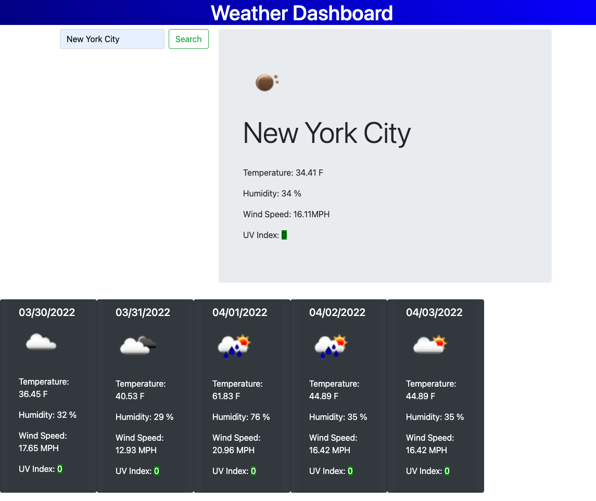

# WeatherWizard

## Description

Using third party API's this application displays the current weather outside as well as the five day future forecast and displays icons to let the user know weather conditions i.e sunny, cloudy rainy, etc.
This application also lets the user know if the UV Index is high by highlighting after a certain threshold.

## Table of Contents

Below are the table of contents for this weather application.

- [Installation](#installation)
- [Usage](#usage)
- [Credits](#credits)

## Installation

This code was developed from scratch. Using the third party API I created an API key to allow access to the data and then uploaded to Github.

This application is deployed in the following links:
https://github.com/kgiunta/WeatherWizard
https://kgiunta.github.io/WeatherWizard/

## Usage

Input which city you would like to see in the search bar and watch the current weather populate as well as the five day forecast.

Below is a screenshot of the application in use.

## Credits

The following people helped bring this application alive:

Jehyun Jung | Penn LPS Tutor  
Dominick Albano |https://github.com/dev-dominick 
Issak Morales |https://github.com/CallMeIce 
